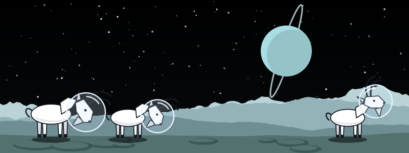

# 45. Automatic Differentiation: Letting the Compiler Write the Backward Pass

{ style="display:block;margin:0 auto;max-width:100%;height:auto;border-radius:6px" }

**What you will understand:** how a backward pass can be **generated** instead of derived by hand, and how to find out whether the generated one is right. Chapters 33 to 36 derived the gradient of an attention classifier, of layer normalisation and of a whole transformer block on paper, wrote each as Mountain Goat code, and checked it with finite differences. Every one of those derivations was a place to make a mistake. This chapter writes a program, `autograd.py`, that takes a Mountain Goat program computing a loss and writes **another Mountain Goat program** that computes the loss and the gradient with respect to chosen matrices. The method is **reverse-mode automatic differentiation**, in about 120 lines of Python over the compiler's own IR. It is then tested four ways: every rule against finite differences of an independent evaluation, ties, the hand-derived gradients of Chapters 33, 34 and 35 (it reproduces all 16 gradient matrices of the transformer block), and ten training steps whose loss curve equals Chapter 33's.

**What you need to know first:** Chapters 33 to 35 (backpropagation by hand: you will see here that the rules are the same ones, applied by a program), Chapter 41 (a Python program over the text of `mgc mlir`). The Mountain Goat compiler is used unchanged: it compiles and runs the generated programs.

!!! tip "Compile and run"
    ```sh
    cd docs/part45/code                                  # plain Python 3; needs the Chapter 44 build (../../part44/code/build.sh) for mgc
    ./make_examples.py                                   # the ground-truth programs, copied from Chapters 33, 34, 35 (already in examples/)
    ./autograd.py examples/00_worked_example.mg --wrt w,x > worked_example_generated.mg    # the transformation
    ./mgc run worked_example_generated.mg                # run what it wrote
    ./autograd.py examples/h33_attention.mg --wrt q0,wk0,wv0,wo0 --descend 10 --lr 3.0 > train.mg   # ten gradient-descent steps
    ./descend_compare.py > descend_out.txt               # the loss curve against Chapter 33's (about 20 seconds)
    ./check_autograd.py > check_autograd_out.txt         # the checks of this page (about 15 seconds)
    ./mutation.py > mutation_out.txt                     # 24 WRONG versions of autograd.py the checker must catch (about 6 minutes)
    ./cost.py > cost_out.txt                             # what the generated backward pass costs (about 3 minutes; needs valgrind)
    cd ../../part15/code && ./run_lit.sh                 # the whole test suite
    ```
    Every listing and output on this page comes from these commands.

!!! note "Why this page shows a mutation run, and why 'caught' is the wanted result"
    `mutation.py` writes broken versions of `autograd.py` (one wrong sign, one missing transpose, ...) and expects the checker to fail on each. "Caught" is good; "NOT CAUGHT" would be a gap. Nothing on this page is a failing test.

## The idea in one example

A loss is a chain of operations. To get its derivative with respect to an input, walk the chain **backwards**: start with "the loss changes by 1 when the loss changes by 1" and, at each operation, turn the sensitivity of its result into sensitivities of its inputs. Each sensitivity is called an **adjoint**, written `g` below. The rule for each operation is the calculus you did by hand in Chapters 33 to 35.

The example (`examples/00_worked_example.mg`): `loss = sum of relu(x @ w) * 2`.

```text
--8<-- "docs/part45/code/examples/00_worked_example.mg"
```

`autograd.py` asks the real front end for the program's `mg` dialect text, inlines function calls so it is one straight-line list of operations, and writes this program:

```text
--8<-- "docs/part45/code/worked_example_generated.mg"
```

Read it in two halves:

- **Forward (lines `v1` to `v5`):** the program's own operations, one `let` each. `v1 = x @ w`, `v2 = relu(v1)`, `v3 = v2 * 2`, `v4 = row_sum(v3)`, `v5 = col_sum(v4)` is the loss.
- **Backward (lines `g6` to `g15`), in reverse order:** `g6 = 1` is the adjoint of the loss. `col_sum` and `row_sum` spread their adjoint over the elements they added (`ones * g`). `* 2.0` multiplies the adjoint by 2. `relu` lets the adjoint through only where its input was positive (`ge(v1, 0)`). `matmul` gives `g @ transpose(w)` to its left input and `transpose(x) @ g` to its right one.

Running it (`mgc run`) prints the loss and the two gradients:

```text
--8<-- "docs/part45/code/worked_example_out.txt"
```

Checking by hand: `x @ w = [[-2.5, -3], [5, 8]]`, `relu` keeps `[[0, 0], [5, 8]]`, times 2 and summed is **26**. The gradient with respect to `w` is `transpose(x) @ [[0, 0], [2, 2]] = [[4, 4], [2, 2]]`, and with respect to `x` it is `[[0, 0], [2, 2]] @ transpose(w) = [[0, 0], [6, 14]]`. The program printed exactly these.

## The rules

`autograd.py` knows one rule per operation of the `mg` dialect. In the table `g` is the adjoint of the result, `a` and `b` are the inputs, `r` is the result:

| operation | contribution to the adjoint of the inputs |
|---|---|
| `a + b` | `g` to each |
| `a - b` | `g` to `a`, `-g` to `b` |
| `a * b` | `g * b` to `a`, `g * a` to `b` |
| `a / b` | `g / b` to `a`, `-(g * a) / (b * b)` to `b` |
| `-a` | `-g` |
| `a + k`, `a - k`, `k - a`, `a * k`, `a / k`, `k / a` | `g`, `g`, `-g`, `g * k`, `g / k`, `-(g * k) / (a * a)` |
| `a @ b` | `g @ transpose(b)` to `a`, `transpose(a) @ g` to `b` |
| `transpose(a)` | `transpose(g)` |
| `reshape(a, m, n)` | `reshape(g, shape of a)` |
| `exp(a)`, `log(a)`, `sqrt(a)` | `g * r`, `g / a`, `g / (2 * r)` |
| `relu(a)` | `g * ge(a, 0)` |
| `ge(a, b)` | nothing (a comparison is flat almost everywhere) |
| `row_sum`, `col_sum` | `g` spread over the summed axis (`ones * g`) |
| `row_max`, `col_max` | `g` to the entries that attain the maximum, **shared equally between ties** |
| a broadcast of `a` | `g` summed back over the broadcast axes |

Two further rules make it a whole algorithm: **a value used more than once receives the sum of its contributions** (`x * x * x` uses `x` three times), and the operations are visited in **reverse** order, so every adjoint is complete before it is used. Everything else is bookkeeping. The code, in full:

```python
--8<-- "docs/part45/code/autograd.py"
```

Three decisions in it are worth knowing about:

- **It is a transformation of programs, not a compiler pass.** Like Chapter 41's back end, it reads the text of `mgc mlir`. That keeps it short, keeps the real compiler as the only thing that runs the numbers, and means its output is an ordinary Mountain Goat program that can be read, edited and compiled with any option of `mgc`. The cost is that it parses printed IR with regular expressions.
- **Ties in a maximum.** `row_max` is not differentiable where two entries tie. The rule gives each tied entry an equal share, so that the total over the row is exactly `g`. That is a choice among valid subgradients, but it is the one that keeps `softmax(x - row_max(x))` invariant to the shift the max implies. The version that gave each tied entry the full `g` is one of the mutants below.
- **`relu` at exactly zero uses `ge(a, 0)`**, gradient 1 there, which is also what Chapters 34 and 35 wrote by hand, so the two agree even at a kink.

## What it generates for a transformer block

Chapter 35's block (embeddings, three layer norms, causal attention, residuals, a feed-forward network and an output layer, 16 trainable matrices) is `examples/h35_transformer_step1.mg`: Chapter 35's own definitions, data and step-1 forward and hand-derived backward code, ending with a print of the loss and then the 16 hand-derived gradients. `make_examples.py` copies those lines from Chapter 35's file (they are not re-typed). Giving `autograd.py` that program and the names of the 16 matrices:

```text
./autograd.py examples/h35_transformer_step1.mg --wrt e0,g10,n10,wq0,wk0,wv0,wo0,g20,n20,w10,c10,w20,c20,gf0,nf0,wu0 > h35_grad.mg
```

writes a 288,339-byte program (the loss and the 16 gradients, computed by the generated backward pass) that compiles and runs with the ordinary `mgc` in a few seconds.

## Does it give the right gradients?

`check_autograd.py` runs five groups of checks.

**1. Every rule, against an independent reference.** Ten small programs between them use every operation: `m01` add, sub, mul, div; `m02` all scalar operations on either side and negation; `m03` broadcasting of a row and a column; `m04` matmul and transpose; `m05` exp, log, sqrt, relu; `m06` sums, maxima and means in both directions; `m07` reshape; `m08` a value used three times; `m09` the stable softmax and cross-entropy; `m11` layer normalisation. The reference is `reference.py`: it evaluates the same flattened program in **plain Python**, with its own code for every operation and none of `autograd.py`'s rules, and differentiates the loss by **central finite differences in double precision** (step 10⁻⁶, so the reference is good to about 10⁻⁹). The generated program is compiled and run by `mgc` and prints six digits, so the comparison is made at 10⁻⁵ relative. Chapters 33 to 35 checked their gradients with finite differences on the *compiled* program, limited to the six printed digits and to a step of 0.01; this reference is much sharper.

**2. Ties.** `col_sum(row_max(m))` for `m = [[1, 3, 3], [2, 2, 0]]` must give `[[0, .5, .5], [.5, .5, 0]]` (hand-worked: finite differences do not apply at a kink).

**3. The hand-derived backward passes of the book.** Chapter 33's attention classifier (four gradient matrices), Chapter 34's layer normalisation, and Chapter 35's transformer block (16 gradient matrices, 648 elements). For each, the program contains the chapter's own hand-derived gradient code; `autograd.py` differentiates the loss print; the two sets of numbers must agree.

**4. Training.** Ten gradient-descent steps at learning rate 3.0 on Chapter 33's classifier, using only the generated gradients (`--descend 10 --lr 3.0`), against the loss that Chapter 33's own trainer printed:

```text
--8<-- "docs/part45/code/descend_out.txt"
```

**5. Refusals.** A loss that is not a 1 × 1 matrix, an unknown name, a matrix the loss does not depend on, a loss that is flat in a matrix (it goes only through `ge`), and a rank-3 program are each refused with a message.

```text
--8<-- "docs/part45/code/check_autograd_out.txt"
```

Two things to read from this output. First, all 112 elements of the ten small programs agree with a reference that shares no code with the rules. Second, **the hand-derived gradients of three chapters were right**: an independent mechanical derivation reproduces all of them, to the six digits the programs print. That is evidence for the hand derivations as much as for the tool; it is also an equality at six printed digits, not at the last bit (the two programs add numbers in different orders).

### Are the checks good enough? Twenty-four wrong versions.

```text
--8<-- "docs/part45/code/mutation_out.txt"
```

All 24 are caught. Which check catches which is the interesting part:

- **The hand-derived programs of Chapters 33 to 35 alone would have missed six of the rules.** The mutants for `k - x`, `k / x`, negation, reshape, broadcasting of a column and `max` ties are caught **only** by the small programs (or the tie test), because the chapters' programs happen not to use those combinations. A check built only from the book's own programs would have given false confidence.
- **The constant-matching mutant is caught only by Chapter 35.** `autograd.py` gives the IR's constants their names back by matching `let` lines to constants **in order**, because Chapter 35 has several lets with equal values (three all-zero bias rows, three all-ones scale rows). Matching by value alone picks the wrong constant.
- Four mutants (a missing transpose in `matmul`, both `matmul` sides, and the broadcast-free `sum` rule) are caught because the generated program **does not compile** (a shape mismatch), reported as "the checker did not finish"; that is a valid detection but a less specific one than a wrong number.
- The three training mutants (the update adds the gradient, the learning rate is ignored, the weights never change) are caught only by the training check; the gradient checks cannot see them.

## What it costs

The generated backward pass against the hand-derived one, for the two big cases (`cost.py`): the number of `let` statements, the size of the source, and the instructions the compiled program executes (valgrind's exact count, `clang -O0`, mgc's defaults of Chapter 43):

```text
--8<-- "docs/part45/code/cost_out.txt"
```

- **Chapter 35's transformer block: the generated program executes 11% more instructions** than the hand-derived one (45.5 million against 41.0 million) and is 1.5 times the size of the source. That is the price of a mechanical derivation with no human simplification: where a person fuses the three layer-norm terms into one expression, the generated code spells out each step.
- **Chapter 33's classifier: the generated program executes half as many instructions** (3.9 million against 8.1 million). That is not a property of automatic differentiation: Chapter 33 wrote each gradient as a separate function that recomputes the forward pass, and the generated program computes the forward pass once and shares it. A hand-derived backward pass written with shared intermediates, as Chapter 35's is, loses that advantage.
- The `let` counts are not comparable for the first case (Chapter 33's seven `let`s call functions that hide hundreds of operations).

Reverse mode also **keeps every forward value alive until the backward pass uses it**: the generated program is a list of `let`s, and every forward intermediate is read again later. Nothing here saves memory by recomputing, as production systems do (checkpointing). On these sizes that did not matter; it would on a large model.

## Tests

One new `lit` file `test/autograd45/check.mlir` (the suite is now 157 tests). The checker is `check_autograd.py` (the five groups above); its output:

```text
--8<-- "docs/part45/code/check_autograd_out.txt"
```

## Limits and what is not established

- **It is a transformation of programs, not a compiler feature.** There is no `mgc grad`; `autograd.py` parses the printed IR with regular expressions, like Chapter 41's back end, and needs `mgc` to be the one from this chapter's directory (or any that prints the same IR).
- **The loss is the first `print` of the program (or the one chosen by `--loss`), and must be a 1 × 1 matrix.** The parameters are `let` matrices given by name, found by matching the `let` lines to the constants **in order**. A `let` whose value is not a literal matrix cannot be named; a literal in an expression that equals a later `let`'s value and comes before it in the file could be matched by mistake (the checker's three ground-truth programs and the ten small ones are not affected).
- **Rank 2 only, static shapes only.** Rank-3 tensors, `permute`, `contract` and dynamic shapes are refused.
- **No gradient through comparisons.** `ge` gives 0, so a loss that depends on a parameter only through a comparison is refused ("does not depend"), and a loss that mixes a smooth path with a comparison differentiates the smooth part only.
- **Agreement with the hand-derived gradients is at six printed digits**, not bitwise; the independent finite-difference reference covers only ten small programs (112 elements), because the big ones are too slow to evaluate in plain Python.
- **No checkpointing, no sparsity, no simplification:** the generated program is larger and slower than a hand-tuned one (11% more instructions on the transformer block) and keeps every intermediate alive.
- **Second derivatives:** the output is an ordinary Mountain Goat program, so it can be differentiated again; Chapter 46 does exactly that (Hessian-vector products) and tests it.
- **Large programs compile slowly:** the generated 200-step training programs of Chapters 35 and 36 were not attempted (at `-O2` even the hand-derived 200-step program takes over 29 minutes to compile, Chapter 44).

## Reproducing

```sh
cd docs/part45/code
./autograd.py examples/00_worked_example.mg --wrt w,x > worked_example_generated.mg && ./mgc run worked_example_generated.mg
./descend_compare.py > descend_out.txt && ./check_autograd.py > check_autograd_out.txt
./mutation.py > mutation_out.txt && ./cost.py > cost_out.txt
cd ../../part15/code && ./run_lit.sh          # 157 tests
```

## Chapter summary

- **Reverse-mode automatic differentiation** is a list of local rules, one per operation, applied to the program's operations in reverse order, with a value used twice receiving the sum of its contributions. `autograd.py` does it as a source-to-source transformation that writes a new Mountain Goat program.
- It reproduces, to the six printed digits, the hand-derived gradients of Chapter 33's attention classifier, Chapter 34's layer normalisation and **all 16 gradient matrices of Chapter 35's transformer block**; and ten gradient-descent steps with the generated gradients give exactly Chapter 33's loss curve (1.60134 → 1.51356 → 0.625597 → 0.273815).
- Every rule matches central finite differences of an independent plain-Python evaluation, in all 112 elements of ten small programs.
- 24 wrong versions of the tool are caught; the book's own programs alone would have missed six of the rules, which is why the small programs exist.
- The generated backward pass of the transformer block costs 11% more instructions than the hand-derived one; it keeps all forward values alive; and it covers rank-2 programs without comparisons in the gradient path.

## Self-check questions

Each answer is collapsed; try the question first.

1. Why does reverse mode walk the operations backwards, and what happens to a value that is used twice?

    ??? note "Answer"
        The derivative of the loss with respect to an operation's result must be complete before it can be turned into contributions to that operation's inputs; walking the operations in reverse order guarantees that every operation after it has already contributed. A value used by several operations receives the **sum** of their contributions (the chain rule over all the paths from it to the loss): `x * x * x` gives `x` three contributions.

2. Derive by hand what `autograd.py` wrote for `col_sum(row_sum(relu(x @ w) * 2.0))` and say why `ge(v1, 0)` appears.

    ??? note "Answer"
        The loss's adjoint is `[[1]]`; `col_sum` and `row_sum` spread it over the elements they summed (`ones * g`); `* 2.0` multiplies by 2; `relu` passes the adjoint where its input was positive, which is `ge(x @ w, 0)` as a 0/1 mask; `matmul` gives `g @ transpose(w)` to `x` and `transpose(x) @ g` to `w`. With `x @ w = [[-2.5, -3], [5, 8]]`, only the second row is positive, so the gradient with respect to `w` is `[[4, 4], [2, 2]]`.

3. Why does the checker compare against a plain-Python reference instead of only against Chapters 33 to 35?

    ??? note "Answer"
        The hand-derived programs of those chapters do not use every operation: six of the 24 wrong versions (`k - x`, `k / x`, negation, reshape, a column broadcast, ties in a maximum) pass all three chapters' comparisons and are caught only by the small programs and the tie test. The reference also shares no code with the rules, so a mistake in a rule cannot be hidden by the same mistake in the reference.

4. What does a tie in a maximum do to the gradient rule, and why share the gradient?

    ??? note "Answer"
        `row_max` has no derivative where two entries are equal. Sharing the gradient equally between the tied entries keeps the total over the row equal to the incoming gradient, so a softmax built as `exp(x - row_max(x))` still has a gradient that is unchanged by shifting `x`. Giving each tied entry the full gradient breaks that (the total becomes larger), which the tie test catches.

5. The generated backward pass of Chapter 33 runs in half the instructions of the hand-derived one, and that of Chapter 35 in 11% more. Why the difference?

    ??? note "Answer"
        Chapter 33's hand-derived gradients are separate functions that each recompute the forward pass, so the program does the forward work several times; the generated program does it once. Chapter 35's hand-derived backward pass shares its intermediates, so the comparison is between two programs that both do the forward pass once, and the generated one pays for not simplifying (for example, spelling out each step of the layer-norm gradient).

6. What does it mean that the generated gradients equal the hand-derived ones, and what does it not mean?

    ??? note "Answer"
        It means two independent derivations (a person's, and a mechanical one) agree on every printed element of 16 gradient matrices, so they are both very probably right. It does not mean they are identical to the last bit (the programs add in different orders and print six digits), and it does not say anything about operations the chapters never used.

7. Name three limits of the claims on this page.

    ??? note "Answer"
        Any of: rank 2 and static shapes only; the loss must be a 1 × 1 first `print`; no gradient flows through comparisons; the independent finite-difference reference covers only the ten small programs; the transformation reads printed IR with regular expressions; the 200-step training programs were not attempted; second derivatives were not tried; the generated program keeps all forward values alive.
